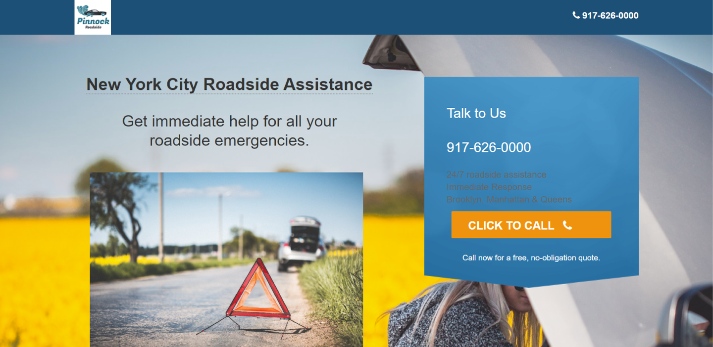

## Pinnock Roadside Assistance | Emergency Roadside Assistance Service

### Screenshot:
  
  
#### [Link to Live Site](https://pinnock-roadside.000webhostapp.com/)  
#### [Link to Repo](https://github.com/Arathurs/Roadside_Assistance_Site.git)  

### About the Project

Redesigned static page website for an emergency roadsite assistance. Company was seeking to increase revenue by acquiring customers online, by way of organic and search ads (primarily Google AdWords). The website was redesigned with a mobile-first approach, which while always important, was especially so in this case as most people in an auto related emergency would only be able to access the internet by smartphone.

Various landing pages were also developed and A/B tested using Google Analytics, increasing the click-through rate 135%. As a result, revenue was increased 50% from online leads within two months of deploying the new website.

### Technologies Used
- HTML5
- CSS5
- Bootstrap 4
- Font Awesome 4.5.0
- Mobile-First
- Responsive Design
- Google Tag Manager
- Google Analytics
- A/B Testing
- Google Adwords